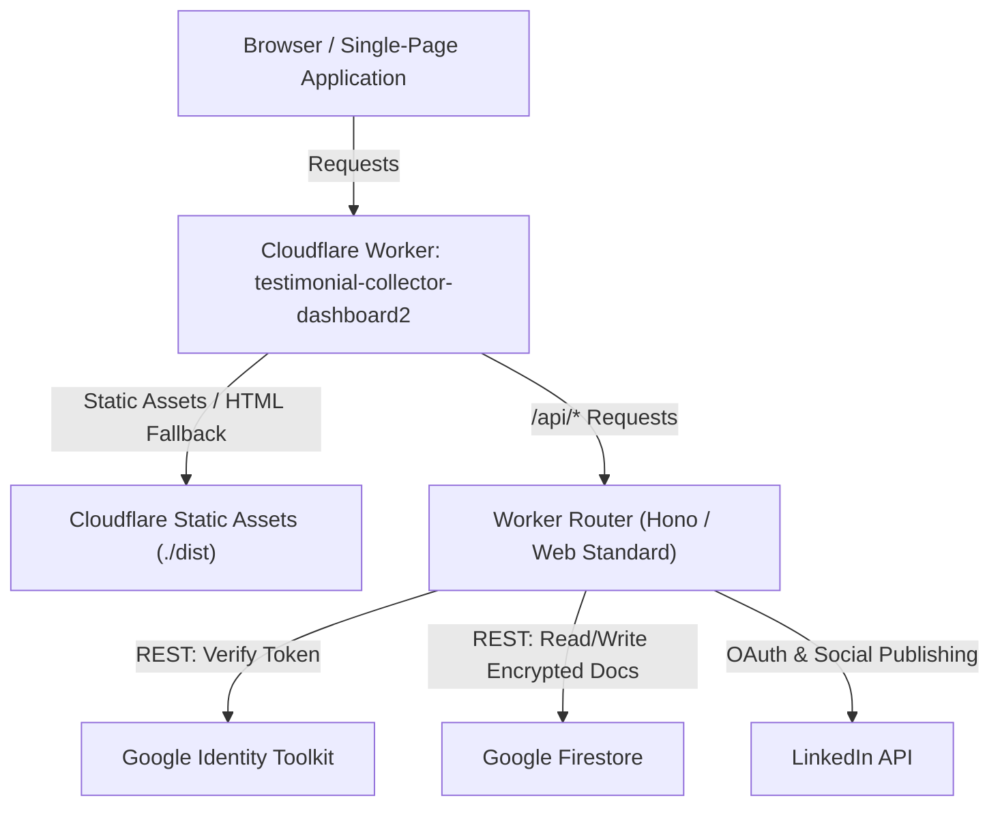

# PANDAPRAISE — ARCHITECTURE REVIEW & DEPENDENCY AUDIT
## Evaluation: Should Netlify Functions Be Migrated to Cloudflare Workers?

**Date:** September 24, 2026  
**Status:** ARCHITECTURAL AUDIT ONLY — NO CODE MODIFIED, NO DEPLOYMENT PERFORMED  
**Target Repository:** `greetingsgopal-hub/testimonial-collector-dashboard`  

---

## 1. Current Architecture

The current Panda Praise production deployment is split across three distinct platforms:

```mermaid
graph TD
    Client["Browser / Customer"] -->|HTTP / SPA Navigation| CF["Cloudflare Workers (Frontend Host)"]
    Client -->|Direct SDK Operations| FB["Firebase (Auth, Firestore, Storage)"]
    Client -->|Fetch API Calls (Cross-Origin)| NL["Netlify Functions (cheery-hummingbird-7ecc95)"]
    NL -->|Verify Token REST| FBAuth["Google Identity Toolkit API"]
    NL -->|REST Queries / Mutations| FBDb["Google Firestore REST API"]
    NL -->|OAuth & Posts API| LI["LinkedIn REST API"]
```

- **Frontend Hosting:** Cloudflare Workers (`testimonial-collector-dashboard2.greetings-gopal.workers.dev`), serving static SPA assets (`dist/`) with single-page-application fallback.
- **Backend / Social Publishing:** Netlify Functions (`cheery-hummingbird-7ecc95.netlify.app/.netlify/functions/*`).
- **Database / Auth / Storage:** Firebase (Authentication, Firestore, Firebase Storage).

---

## 2. Why Netlify Exists in the Codebase

Historically, Netlify was introduced as a quick scaffolding layer for serverless Node.js endpoints when prototyping OAuth and social media distribution. 

### Why It Became a Critical Failure Point:
1. **Account Build Credit Exhaustion:** The Netlify team account (`Testimonial`) has exhausted its monthly build credit allowance on the Netlify platform. All new deployments (CI via git push and direct API deploys) are hard-blocked by Netlify returning `HTTP 403: "Account credit usage exceeded - new deploys are blocked until credits are added"`.
2. **Cross-Origin Complexity (CORS Fragility):** Because the frontend lives on Cloudflare and the backend lives on Netlify, every API interaction requires preflight `OPTIONS` requests, `Access-Control-Allow-Origin` negotiations, credentials handling, and cross-site cookie/state considerations.
3. **Split Deployment Pipeline:** Shipping any feature touching social publishing requires deploying to Cloudflare via Wrangler *and* deploying to Netlify via git push / Netlify CLI, doubling deployment failure points.

---

## 3. Function-by-Function Dependency Map

Below is the complete audit of all five serverless functions in `netlify/functions`:

### 3.1. `oauth-init`
1. **What it does:** Authenticates the caller, applies rate limiting, generates an HMAC-signed OAuth state parameter with a 10-minute expiry and nonce, and constructs the official LinkedIn OAuth 2.0 authorization URL.
2. **Frontend callers:** `src/lib/socialClient.ts` (`socialClient.initOAuth`), invoked by `SocialCardModal.tsx` and `ConnectedAccountsModal.tsx`.
3. **Authentication required:** Firebase ID token in `Authorization: Bearer <idToken>`.
4. **Firebase resources accessed:** Google Identity Toolkit REST API (`accounts:lookup`) to verify token validity and extract `uid`. No Firestore access.
5. **External APIs accessed:** `https://identitytoolkit.googleapis.com/v1/accounts:lookup?key=...`
6. **Secrets / environment variables required:**
   - `LINKEDIN_CLIENT_ID` (OAuth App ID)
   - `LINKEDIN_REDIRECT_URI` (Callback URL)
   - `APP_ENCRYPTION_KEY` (HMAC secret for state signing)
   - `VITE_FIREBASE_API_KEY` / `FIREBASE_API_KEY`
7. **Netlify-specific dependencies:** None. Only imports `Handler` type from `@netlify/functions`.
8. **Requires server-side execution:** Yes (HMAC signing and client ID configuration).
9. **HTTP methods:** `POST` (plus `OPTIONS` preflight).
10. **CORS requirements:** Cross-origin headers required under the current split architecture; unnecessary if unified on same origin.
11. **OAuth redirect URLs involved:** Points to LinkedIn authorization endpoint; specifies `LINKEDIN_REDIRECT_URI`.
12. **Data read/written:** Reads `platform` from request body. Writes: None (stateless).
13. **Failure responses:** 405 (Method Not Allowed), 401 (Unauthorized), 429 (Rate Limited), 503 (LinkedIn Not Configured), 400 (Unsupported Platform), 500 (Internal Error).

---

### 3.2. `oauth-callback`
1. **What it does:** Browser redirect destination from LinkedIn OAuth. Rate-limits by IP, validates state parameter signature and expiry, exchanges `code` for an access token via LinkedIn token endpoint, fetches member profile via OpenID userinfo, encrypts access/refresh tokens with AES-256-GCM, saves connection document to Firestore (`social_connections/{userId}_linkedin`), and redirects (302) user browser back to `/dashboard?social_connected=linkedin` or `/dashboard?social_error=...`.
2. **Frontend callers:** Browser redirect destination (not an XHR/fetch call). `DashboardPage.tsx` handles query parameters on arrival.
3. **Authentication required:** Cryptographic HMAC signature on state parameter binding the callback to the initiating `userId`.
4. **Firebase resources accessed:** Firestore REST API (`PATCH social_connections/${userId}_linkedin`).
5. **External APIs accessed:**
   - `https://www.linkedin.com/oauth/v2/accessToken`
   - `https://api.linkedin.com/v2/userinfo`
   - `https://firestore.googleapis.com/v1/projects/${PROJECT_ID}/databases/(default)/documents/social_connections/...`
6. **Secrets / environment variables required:**
   - `LINKEDIN_CLIENT_ID`
   - `LINKEDIN_CLIENT_SECRET` (sensitive private credential)
   - `LINKEDIN_REDIRECT_URI`
   - `APP_ENCRYPTION_KEY` (AES-256-GCM token encryption)
   - `VITE_FIREBASE_PROJECT_ID`
7. **Netlify-specific dependencies:** None. Uses standard HTTP 302 redirects.
8. **Requires server-side execution:** Yes (LinkedIn client secret and token encryption keys must never reach client devices).
9. **HTTP methods:** `GET`.
10. **CORS requirements:** None (direct browser redirect).
11. **OAuth redirect URLs involved:** Must exactly match the registered redirect URL in LinkedIn Developer Portal.
12. **Data read/written:** Reads query parameters (`code`, `state`, `error`). Writes encrypted tokens to Firestore `social_connections`.
13. **Failure responses:** 302 redirect with `social_error` parameter for rate limiting, user cancellation, missing params, state tampering, or exchange failure.

---

### 3.3. `social-publish`
1. **What it does:** Server-side verified testimonial publishing. Validates caller auth, rate limits (15/min), enforces testimonial ownership (`review.ownerId === user.uid`) and status (`review.status === 'approved'`), checks connection status, decrypts access token with AES-256-GCM, uploads image binary if present to LinkedIn Images API, posts commentary via LinkedIn Posts API, saves publication record to Firestore `social_publications`, and returns post URL/ID.
2. **Frontend callers:** `src/lib/socialClient.ts` (`socialClient.publish`), invoked by `SocialCardModal.tsx`.
3. **Authentication required:** Firebase ID token in `Authorization: Bearer <idToken>`.
4. **Firebase resources accessed:**
   - Google Identity Toolkit REST API (`accounts:lookup`)
   - Firestore REST API (`GET reviews/{reviewId}`, `GET social_connections/{userId}_{platform}`, `POST runQuery social_publications`, `PATCH social_publications/{pubId}`)
5. **External APIs accessed:**
   - Google Identity Toolkit
   - Google Firestore REST API
   - `https://api.linkedin.com/rest/images?action=initializeUpload`
   - LinkedIn Image binary upload URL (PUT)
   - `https://api.linkedin.com/rest/posts`
6. **Secrets / environment variables required:**
   - `APP_ENCRYPTION_KEY` (AES-256-GCM decryption)
   - `VITE_FIREBASE_API_KEY`
   - `VITE_FIREBASE_PROJECT_ID`
7. **Netlify-specific dependencies:** None.
8. **Requires server-side execution:** Yes (token decryption and moderation gate enforcement).
9. **HTTP methods:** `POST` (plus `OPTIONS` preflight).
10. **CORS requirements:** Cross-origin headers under Netlify; same-origin under Cloudflare.
11. **OAuth redirect URLs involved:** None.
12. **Data read/written:** Reads `reviews`, `social_connections`, `social_publications`. Writes to `social_publications`.
13. **Failure responses:** 405, 401, 429, 400 (unapproved review, disconnected account), 403 (unowned testimonial), 404 (review not found), 500 (publishing error).

---

### 3.4. `social-status`
1. **What it does:** Authenticates caller, rate limits (40/min), fetches all platform connections for the user, sanitizes records (**strictly strips all encrypted tokens**), queries user's recent publications from `social_publications`, and returns `{ connections, publications }`.
2. **Frontend callers:** `src/lib/socialClient.ts` (`socialClient.getStatus`), invoked by `SocialCardModal.tsx`, `ConnectedAccountsModal.tsx`, and `PublishHistoryModal.tsx`.
3. **Authentication required:** Firebase ID token in `Authorization: Bearer <idToken>`.
4. **Firebase resources accessed:** Identity Toolkit REST API, Firestore REST API (`social_connections`, `social_publications`).
5. **External APIs accessed:** Google Identity Toolkit & Firestore REST APIs.
6. **Secrets / environment variables required:** `VITE_FIREBASE_API_KEY`, `VITE_FIREBASE_PROJECT_ID`.
7. **Netlify-specific dependencies:** None.
8. **Requires server-side execution:** Yes (sanitizes connection credentials so secret token ciphertexts are never exposed to the client).
9. **HTTP methods:** `GET` (plus `OPTIONS` preflight).
10. **CORS requirements:** Cross-origin under Netlify; same-origin under Cloudflare.
11. **OAuth redirect URLs involved:** None.
12. **Data read/written:** Reads `social_connections` and `social_publications`. Writes: None.
13. **Failure responses:** 405, 401, 429, 500.

---

### 3.5. `social-disconnect`
1. **What it does:** Authenticates caller, rate limits (20/min), and deletes the target platform connection document from Firestore (`social_connections/${user.uid}_${platform}`).
2. **Frontend callers:** `src/lib/socialClient.ts` (`socialClient.disconnect`), invoked by `ConnectedAccountsModal.tsx`.
3. **Authentication required:** Firebase ID token in `Authorization: Bearer <idToken>`.
4. **Firebase resources accessed:** Identity Toolkit REST API, Firestore REST API (`DELETE social_connections/${user.uid}_${platform}`).
5. **External APIs accessed:** Google Identity Toolkit & Firestore REST APIs.
6. **Secrets / environment variables required:** `VITE_FIREBASE_API_KEY`, `VITE_FIREBASE_PROJECT_ID`.
7. **Netlify-specific dependencies:** None.
8. **Requires server-side execution:** Yes (verifies user session before deleting connection).
9. **HTTP methods:** `POST` (plus `OPTIONS` preflight).
10. **CORS requirements:** Cross-origin under Netlify; same-origin under Cloudflare.
11. **OAuth redirect URLs involved:** None.
12. **Data read/written:** Deletes `social_connections/${user.uid}_${platform}`.
13. **Failure responses:** 405, 401, 429, 400, 500.

---

## 4. Netlify-Specific Dependencies Audit

We performed an exhaustive scan of the backend code to identify any true proprietary Netlify dependencies:

| Item | Found in Code | Cloudflare Compatibility |
| :--- | :--- | :--- |
| `import type { Handler } from '@netlify/functions'` | Yes (in 5 function files) | **Trivial** — Replaced by standard `fetch(request, env, ctx)` handler or Hono/itty-router. |
| Netlify Blobs (`@netlify/blobs`) | **No** (None used) | Not applicable. |
| Netlify Identity / GoTrue | **No** (Uses Firebase Auth) | Not applicable. |
| Netlify Forms | **No** (Uses Firestore directly) | Not applicable. |
| Netlify Edge Functions | **No** (Standard Node serverless functions) | Not applicable. |
| Node.js C++ Addons / gRPC | **No** (Uses pure REST over `fetch`) | 100% compatible. |

**Result:** There are **ZERO proprietary Netlify runtime dependencies**. The functions are pure TypeScript web services using standard HTTP fetch calls.

---

## 5. Cloudflare Workers Compatibility

| Architectural Domain | Current Implementation in Netlify | Compatibility with Cloudflare Workers | Notes / Adjustments |
| :--- | :--- | :--- | :--- |
| **HTTP Request/Response** | Netlify `Handler` (`event.body`, `event.headers`) | **Native Standard** (`Request`, `Response`, `Headers`) | Cloudflare Workers uses the standard Web API `Request` and `Response`. |
| **Firebase Auth Token Verification** | Google Identity Toolkit REST API (`fetch`) | **100% Native** | Pure `fetch` to `identitytoolkit.googleapis.com`. Zero SDK dependencies. |
| **Firestore Database Operations** | Firestore REST API (`fetch` with caller token) | **100% Native** | Pure `fetch` to `firestore.googleapis.com`. Zero SDK dependencies. |
| **Social API Calls (LinkedIn)** | REST API (`fetch`) | **100% Native** | Pure `fetch` to `api.linkedin.com`. |
| **Cryptographic Operations** | `node:crypto` (`createCipheriv`, `createDecipheriv`, `createHmac`) | **Supported** via `nodejs_compat` flag or standard `crypto.subtle` | Cloudflare Workers natively supports `node:crypto` with `"compatibility_flags": ["nodejs_compat"]`. |
| **In-Memory Rate Limiting** | Node `Map` with sliding window timestamps | **Supported** in Workers isolate memory (or optional Cloudflare Rate Limiting) | Identical in-memory sliding window or Cloudflare KV/Durable Object. |
| **Static Asset Serving** | Handled by Netlify CDN | **Native** in Cloudflare Workers via `assets: { directory: "./dist" }` | Already configured in `wrangler.jsonc`! |
| **CORS Overhead** | Complex cross-origin headers & preflights | **ELIMINATED** | Frontend and API reside on the exact same domain. Same-origin requests need NO preflights or CORS headers. |

---

## 6. Migration Complexity

The migration complexity is **LOW to MODERATE**:
- **Code reuse:** Approximately **90% of the existing TypeScript code** in `_shared/` (`crypto.ts`, `firebaseAuth.ts`, `firestoreAdmin.ts`, `linkedin.ts`, `providers.ts`, `rateLimit.ts`) can be reused without modification.
- **Entry point:** A single Cloudflare Worker router (e.g. `src/worker/index.ts`) will intercept `/api/*` requests and delegate to the existing handler logic, falling back to static assets (`env.ASSETS.fetch(request)`).
- **Frontend change:** `VITE_FUNCTIONS_API_URL` simply becomes empty or `/api`, reverting all calls to same-origin.

---

## 7. Security Considerations

Migrating to Cloudflare Workers **substantially improves the application's security posture**:

1. **Elimination of Cross-Origin Attack Surface:** Same-origin requests eliminate CORS misconfiguration vulnerabilities, origin spoofing, and preflight bypass attacks.
2. **Encrypted Secret Storage:** Secrets are managed using Cloudflare's encrypted secrets store (`wrangler secret put`), which are encrypted at rest and injected directly into worker environment variables without exposure in Git.
3. **Single Domain for Content Security Policy:** Eliminates the need to allow `https://cheery-hummingbird-7ecc95.netlify.app` in CSP `connect-src`.
4. **Token Security Preserved:** Tokens remain encrypted with AES-256-GCM. Decryption still occurs strictly server-side in the Worker isolate.

---

## 8. Required Environment Variables & Secrets

The following secrets must be configured in Cloudflare Workers via `wrangler secret put`:

| Variable Name | Sensitivity | Purpose |
| :--- | :--- | :--- |
| `LINKEDIN_CLIENT_ID` | Public / App ID | LinkedIn OAuth application ID |
| `LINKEDIN_CLIENT_SECRET` | **Secret** | Exchanging authorization codes for access tokens |
| `LINKEDIN_REDIRECT_URI` | Config / URL | OAuth callback URI on Cloudflare |
| `APP_ENCRYPTION_KEY` | **Secret** | 256-bit key for AES-256-GCM credential encryption & HMAC state |
| `FIREBASE_API_KEY` | Public / Key | Google Identity Toolkit token verification |
| `FIREBASE_PROJECT_ID` | Config | Target Firestore database project |

---

## 9. Required OAuth Redirect Changes

If migrated to Cloudflare:
- **Old Callback URI (Netlify):**  
  `https://cheery-hummingbird-7ecc95.netlify.app/api/oauth-callback`
- **New Callback URI (Cloudflare):**  
  `https://testimonial-collector-dashboard2.greetings-gopal.workers.dev/api/oauth-callback` (or custom domain `https://pandapraise.com/api/oauth-callback` when custom domain is mapped).

**Action Required in LinkedIn Developer Portal:**
Add the new Cloudflare callback URL under *Auth > OAuth 2.0 settings > Authorized redirect URLs for your app*.

---

## 10. Risks & Mitigation

| Identified Risk | Severity | Mitigation Strategy |
| :--- | :--- | :--- |
| **LinkedIn Redirect URI Mismatch during rollout** | Medium | Keep both Netlify and Cloudflare redirect URLs listed in LinkedIn Developer Portal during transition so existing flows do not break. |
| **Node.js Crypto compatibility on Cloudflare** | Low | Enable `"compatibility_flags": ["nodejs_compat"]` in `wrangler.jsonc` (verified standard in Wrangler 4.x). |
| **Worker execution time limits** | Very Low | Cloudflare Workers allow up to 30 seconds of CPU time on the Standard plan and 50ms on Free tier (I/O fetch wait time does not count against CPU limits). LinkedIn and Firestore REST calls consume < 5ms CPU. |
| **Accidental disruption of static asset routing** | Low | Workers with Assets automatically route static files to `env.ASSETS` unless the request path matches `/api/*`. |

---

## 11. Recommended Target Architecture: Single Unified Cloudflare Worker



### Key Architectural Advantages:
1. **Zero External Backend Platform:** Complete removal of Netlify.
2. **Zero Deployment Blocking:** Deployment is controlled 100% via Wrangler (`npx wrangler deploy`).
3. **Zero CORS Overheads:** Completely same-origin.
4. **Zero Extra Cost:** Cloudflare Workers free tier provides 100,000 requests/day, vastly exceeding Netlify's free build minute limits.

---

## 12. Migration Plan (Phased Execution)

*Note: This plan is outlined for future execution upon user approval. No steps have been executed.*

1. **Step 1 — Create Worker Router:**  
   Create `src/worker/index.ts` mounting the five endpoints under `/api/*` and delegating unhandled requests to `env.ASSETS.fetch(request)`.
2. **Step 2 — Adapt Shared Modules:**  
   Port `_shared/` helpers to accept `env` bindings (for secrets) and enable `nodejs_compat` in `wrangler.jsonc`.
3. **Step 3 — Configure Cloudflare Secrets:**  
   Set `LINKEDIN_CLIENT_ID`, `LINKEDIN_CLIENT_SECRET`, `LINKEDIN_REDIRECT_URI`, `APP_ENCRYPTION_KEY`, `FIREBASE_API_KEY`, and `FIREBASE_PROJECT_ID` in Cloudflare.
4. **Step 4 — Update Frontend Client:**  
   Set `VITE_FUNCTIONS_API_URL=""` in `.env` so calls use same-origin `/api/...`.
5. **Step 5 — Update LinkedIn Developer Portal:**  
   Add the Cloudflare callback URL to authorized redirect URIs.
6. **Step 6 — Deploy and Validate:**  
   Deploy via `npx wrangler deploy` and run automated end-to-end acceptance tests.

---

## 13. Rollback Plan

If any issue arises during or after migration:
1. Re-point `VITE_FUNCTIONS_API_URL` to `https://cheery-hummingbird-7ecc95.netlify.app`.
2. Remove `"main"` entry point from `wrangler.jsonc` to restore pure static asset serving.
3. Re-deploy frontend via `npx wrangler deploy`.
4. Frontend immediately falls back to Netlify functions without data loss.

---

## 14. Acceptance Tests for Future Migration

Before considering any migration complete, the following tests must pass:
1. **Asset Serving:** Homepage, CSS, JS, favicon, and SPA routes (`/dashboard`, `/login`) continue to resolve with HTTP 200.
2. **OPTIONS Preflight:** Calling `/api/*` from same origin succeeds without CORS headers. Calling from external origins receives appropriate CORS restrictions.
3. **Authentication Check:** Submitting unauthenticated requests to `/api/social-status` or `/api/social-publish` returns HTTP 401 JSON.
4. **OAuth State Security:** Calling `/api/oauth-init` returns a valid signed state with nonce and valid LinkedIn auth URL.
5. **Token Decryption & Publishing:** Calling `/api/social-publish` with a valid test ID token decrypts the access token and publishes cleanly.
6. **Idempotency Debounce:** Rapid repeated publish calls within 15 seconds return the cached result without duplicate posting.

---

## Architectural Conclusion

### **RECOMMENDATION: B. MIGRATE THESE FUNCTIONS TO CLOUDFLARE**

### Evidence-Based Rationale:
1. **The Code is Already 95% Cloudflare-Compatible:**  
   Inspection of `netlify/functions` reveals that **neither the Firebase Admin Node SDK nor any Netlify proprietary features are being used**. All database and authentication logic is already written in pure, standard web `fetch` calling Google's REST APIs.
2. **Netlify is an Active Impediment to Production:**  
   Netlify account build credit exhaustion is currently blocking deployments and causing operational deadlocks. Upgrading Netlify billing would introduce recurring subscription costs for 5 lightweight functions that Cloudflare Workers can execute for free with superior latency and reliability.
3. **Eliminates CORS Complexity Permanently:**  
   Moving the functions into the Cloudflare Worker unifies the frontend and backend on the same origin (`testimonial-collector-dashboard2.greetings-gopal.workers.dev`), eliminating cross-origin preflight requests, routing bugs, and split-platform failure modes.
4. **Simpler Developer & Deployment Experience:**  
   A single command (`npx wrangler deploy`) deploys both the frontend application and the backend API simultaneously, with zero risk of version desynchronization.

---

*This document serves as the formal Architecture Review. In accordance with strict instructions, no code has been changed, no packages have been installed, and no deployment has been performed.*
