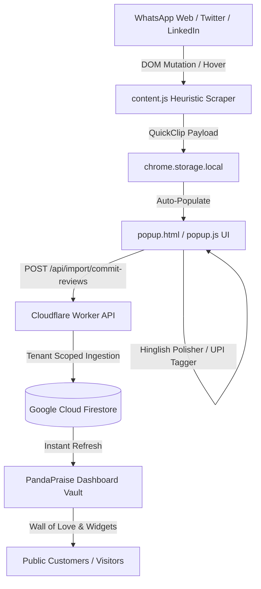

# PandaPraise Chrome Extension: Official User Guide & Strategic Playbook
**Version 1.1.0 (India & Global Edition)**  
*1-Click WhatsApp Web Clipper, UPI Transaction Proof Validator, Hinglish Polisher & Sales Pitch Accelerator*

---

## 1. Executive Summary & Product Introduction

The **PandaPraise Chrome Extension** is an enterprise-grade Manifest V3 browser extension built to eliminate all friction in capturing, verifying, and deploying customer social proof. 

Traditional testimonial software (like Senja.io) was engineered primarily for the Silicon Valley bubble—focusing almost exclusively on Twitter/X, Product Hunt, and email forms. However, in India and emerging global markets, **over 90% of commerce, client communication, freelancer approvals, agency agreements, coaching praise, and D2C customer feedback occur inside WhatsApp Web, accompanied by UPI payment confirmations.**

PandaPraise redefines social proof collection by turning your browser into a **bi-directional trust engine**:
1. **Inbound Capture**: 1-click clipping directly from WhatsApp Web chats, Twitter/X feeds, LinkedIn posts, Slack, and generic web highlights straight into your PandaPraise Proof Vault.
2. **Outbound Conversion**: A real-time sales weapon allowing founders and sales reps to search their testimonial library and drop formatted social proof directly into live WhatsApp, LinkedIn, or Email conversations in under 2 seconds.

---

## 2. The Validated "Unfair Advantage" (PandaPraise vs. Senja.io)

| Dimension | Senja.io Chrome Extension | PandaPraise Chrome Extension | The Unfair Advantage |
| :--- | :--- | :--- | :--- |
| **Primary Channel** | Twitter/X & Web forms | **WhatsApp Web Native In-Chat** | **500M+ WhatsApp users in India.** While Senja forces tedious manual screenshots, PandaPraise injects 1-click capture buttons directly onto WhatsApp chat bubbles. |
| **Transaction Proof** | None (only star rating & text) | **Auto UPI & Transaction Detector** | Scans for UPI reference IDs, UTR numbers, and ₹ amounts to tag reviews as **Verified Transaction Proof**, eliminating fake testimonial skepticism. |
| **Language & Nuance** | English only | **1-Click Hinglish <-> English Polisher** | Converts colloquial praise (*"bhai kaam bohot mast hua"*) into high-converting corporate pitch copy while preserving the authentic raw quote. |
| **Sales Acceleration** | Read-only search & copy | **1-Click "Drop into Active Chat"** | Automatically types and injects formatted case studies and citations straight into your active WhatsApp Web composer or LinkedIn DM. |
| **Pricing & Accessibility** | **$39 to $79 / month** (~₹3,300 to ₹6,600/mo) via US Stripe | **₹100 / month** (~₹3/day) via UPI & Indian NetBanking | **40x cheaper.** Eliminates RBI credit card mandate failure; priced as an impulse buy for any freelancer, creator, or agency. |
| **Trial Model** | Gated features | **7-Day Full Access Trial** | Unrestricted access to all features upon installation with a real-time countdown badge. |
| **Setup Friction** | Requires manual login flows | **Zero-Touch Auto-Sync** | Automatically connects to your active project session whenever you visit `pandapraise.com/dashboard`. |

---

## 3. Core Capabilities & Feature Breakdown

### A. Native WhatsApp Web In-Chat Clipper
* **How it works**: Monitors `web.whatsapp.com` chat containers. When hovering over any received message bubble, an unobtrusive **🐼 Clip** badge appears.
* **Extraction**: Automatically extracts the client's contact name or phone number, exact message text, and timestamp.
* **Outcome**: Saves WhatsApp testimonials in seconds without switching browser tabs or taking clunky cropped screenshots.

### B. Automated UPI & Payment Proof Tagger
* **How it works**: Detects financial transaction markers (`₹`, `INR`, `UTR`, `UPI`, `GPay`, `PhonePe`, `Paytm`, `credited`, `payment received`).
* **Extraction**: Automatically activates the `💳 Verified UPI / Transaction Proof` badge and tags the review with `verified_upi_proof`.
* **Outcome**: Elevates conversion rates by proving to prospective clients that the endorsement comes from a paying client.

### C. 1-Click Hinglish <-> Global English AI Polisher
* **How it works**: Uses colloquial pattern recognition to detect informal Indian praise phrases (e.g., *"ekdum top class"*, *"paisa vasool"*, *"dil khush ho gaya"*, *"kaam bohot badhiya hai"*).
* **Extraction**: Clicking **🪄 Hinglish Polish** transforms the text into polished, high-converting international pitch copy (*"Top-tier service delivering extraordinary value for money and exceeding expectations"*).
* **Outcome**: Dual-purpose utility: Use raw Hinglish for maximum Indian relatability, or polished English for global enterprise clients on Upwork/LinkedIn.

### D. Sales Pitch Vault Search & "Drop in Chat"
* **How it works**: The **Search Vault** tab queries your live project testimonials by keyword, client name, or tag.
* **Execution**: Beside each testimonial card, three action buttons are available:
  1. `Copy Quote`: Copies clean text.
  2. `Copy Citation`: Copies client attribution format.
  3. `💬 Drop in Chat`: Injects the testimonial directly into the active WhatsApp Web message input box, ready to send with Enter!
* **Outcome**: Instant objection handling during sales conversations without breaking conversational momentum.

### E. Zero-Touch Auto-Auth Sync
* **How it works**: Communicates securely with `pandapraise.com` via window messaging and cross-storage sync.
* **Outcome**: No manual API keys or Project ID pasting. Once you log into your dashboard, the extension is instantly paired with your active project.

---

## 4. Technical Architecture & Security Flow



### Security & Privacy Protections
1. **Cross-Tenant Guarding**: All submissions are bound to the caller's verified `projectId`. Requests attempting to spoof foreign tenant IDs are rejected with `403 Forbidden`.
2. **Zero Plaintext Token Storage**: Authentication leverages session-derived tenant tokens; no database root credentials ever touch browser client scripts.
3. **Local-First Scraping**: Content scripts only inspect DOM nodes in the active viewport during user interaction. No background keylogging or private chat indexing occurs.

---

## 5. Step-by-Step Installation & Quickstart Manual

### Installation (10 Seconds)
1. Open Google Chrome or Microsoft Edge.
2. Navigate to:
   - Chrome: `chrome://extensions`
   - Edge: `edge://extensions`
3. Toggle **Developer mode** to **ON** in the top-right corner.
4. Click **"Load unpacked"** in the top-left corner.
5. Select the folder:
   ```
   C:\Users\User\OneDrive\Desktop\MY PROJ\testimonial-collector-dashboard\extension
   ```
6. Click the extension puzzle icon in your browser toolbar and pin **PandaPraise** to your toolbar.

### First-Time Project Pairing
* Visit your dashboard at [https://pandapraise.com/dashboard](https://pandapraise.com/dashboard).
* The extension automatically detects your workspace and active project. When you open the popup, you will see `✨ 7d Trial Left` and your project ready to receive proof!

---

## 6. Daily Operational Playbooks

### Playbook 1: Clipping WhatsApp Praise in Real-Time
1. Open `web.whatsapp.com` and open a client chat.
2. Hover your mouse over the client's message praising your service.
3. Click the purple **🐼 Clip** button on the top-right of the message.
4. The extension captures the sender's name, message, and checks for UPI transaction markers.
5. Click the Panda icon in your browser bar, verify the star rating, and click **"Save to Proof Vault"**.

### Playbook 2: Overcoming Objections in Sales Calls (The "Vault Drop")
1. A prospect on WhatsApp asks: *"Have you worked with SaaS companies before?"*
2. Click the PandaPraise extension icon and select **Search Vault**.
3. Type `"SaaS"` in the search bar.
4. Click **💬 Drop in Chat** on the best review.
5. The testimonial instantly appears inside your WhatsApp chat box. Hit **Enter** to close the lead.

---

## 7. Commercial Model & Subscription Details

* **7-Day Free Trial**: Automatically begins upon installation. Provides 100% full access to WhatsApp clipping, UPI proof verification, and sales chat drops.
* **PandaPraise Pro Subscription**: **₹100 / month** (billed monthly, ~₹3/day).
* **Payment Support**: Integrated for Indian payment rails via UPI (Google Pay, PhonePe, Paytm), RuPay, NetBanking, and International Cards.
* **Activation**: Subscribing updates your account status automatically across your dashboard and browser extension.
